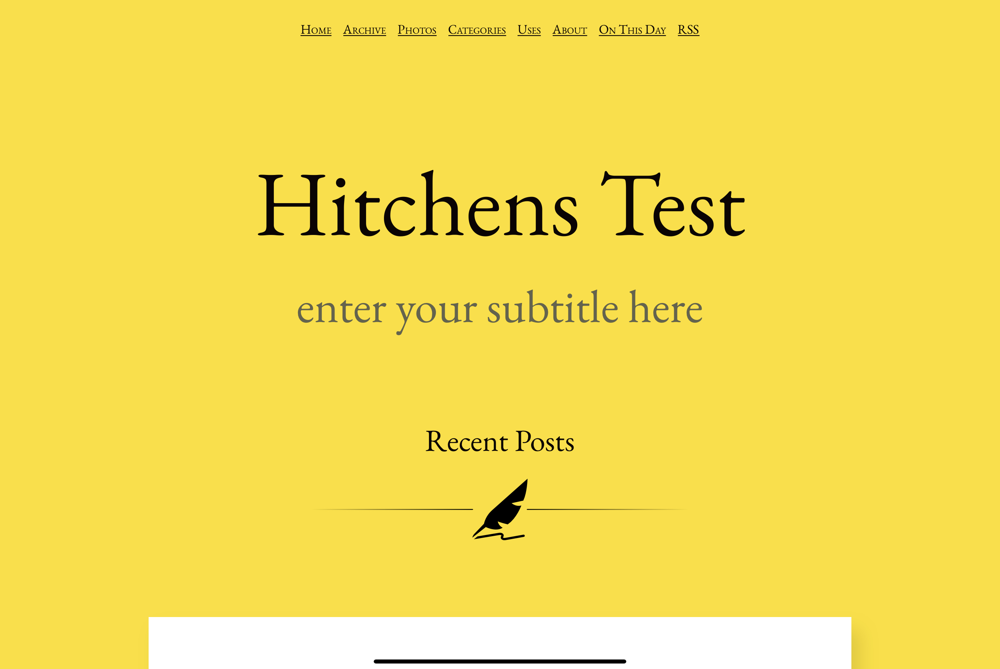
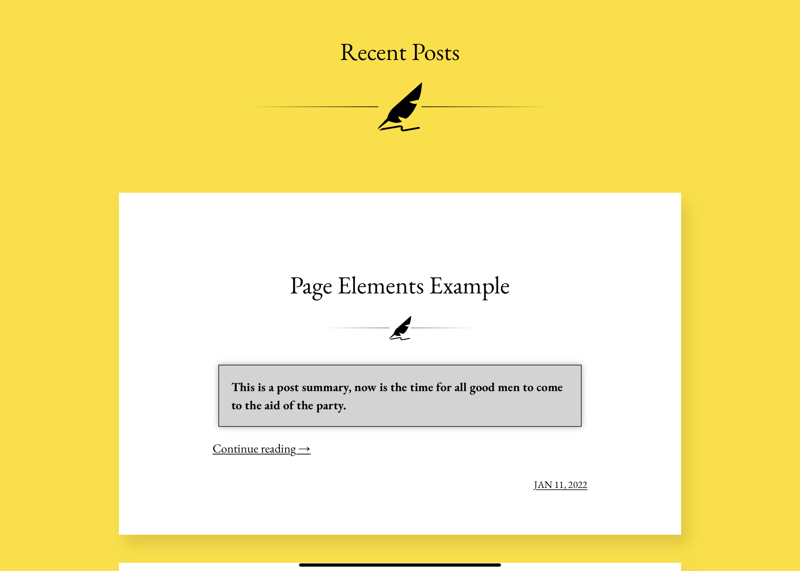
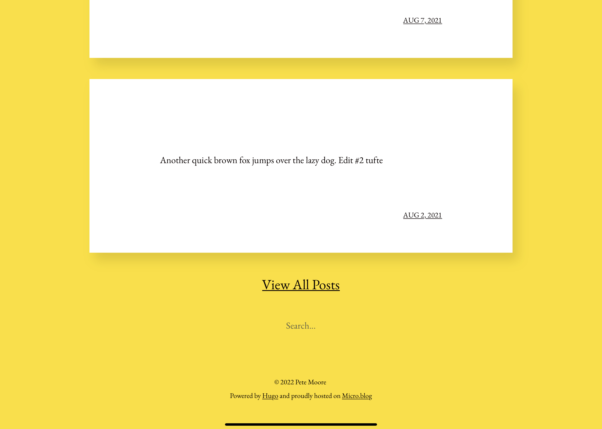
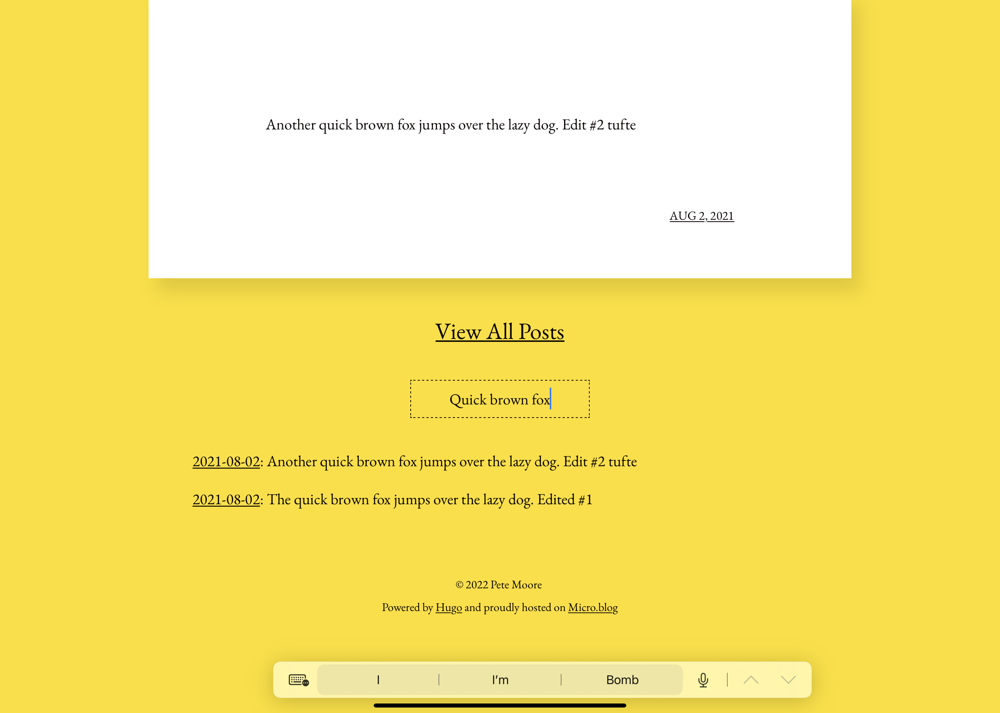
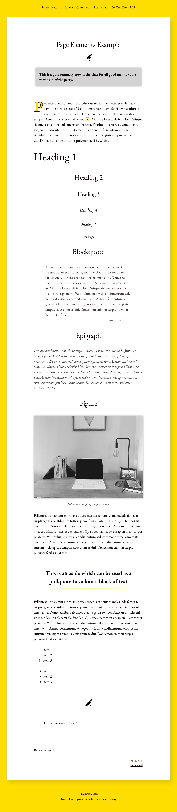
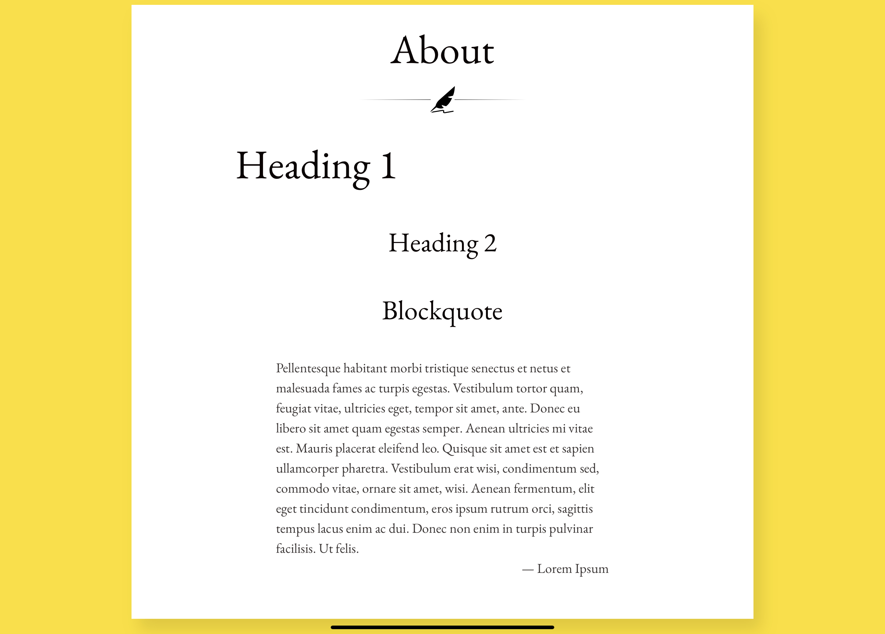
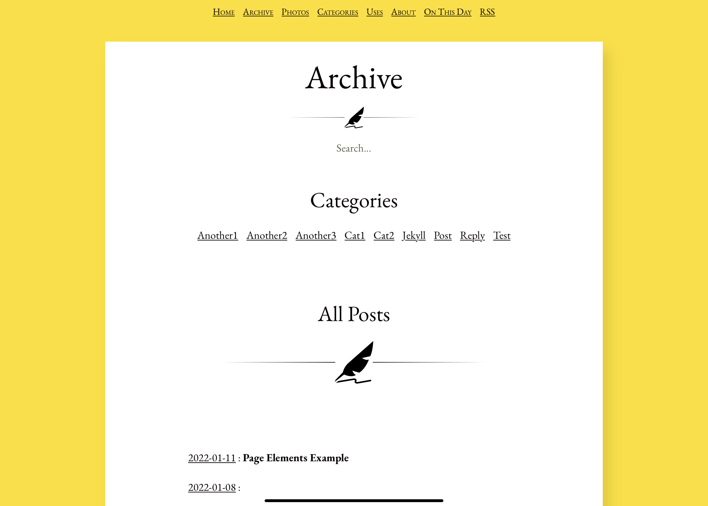

# Hitchens for Micro.blog

**An inarguably well designed theme.  Ported from and based on Hitchens for Jekyll, by Pat Dryburgh**  

## Features

* customizable body and article background, text, divider, dropcap and aside colours using CSS variables
* fully styled Micro.blog conversation elements
* additional styled article elements include:
	* post excerpts
	* dropcaps
	* blockquotes and epigraphs
	* footnotes
	* asides
	* figures
	* divider SVG elements inlined within the CSS itself
* index page includes the 10 most recent posts, with a link below to view the archive
* inline search boxes on both the bottom of the index page, and in the archive
* **there are no shortcodes in this theme**
* no dark mode available as of yet, debating if this theme would work well with one
	
## Walkthroughs

### CSS variables

**Note: at some point I'm going to update this theme to work with Hugo 0.91, which has SASS compiling. These variables and exceptions listed below may change at that point.  These are found near the top of the CSS file in the :root code block**

--body-bg: #fede00;
* the main yellow background colour, also applied in dropcaps and aside top and bottom borders
	
--body-rgba: rgba(254, 222, 0, 1);
* the rgba version of the same background colour, specifically used to designate the middle gradient portion of the aside border
* **if you change the --body-bg colour to something else, you must convert yourself to rgba values and change this variable's value to match (this may change with a SASS capable version of the theme)**
* a good site to to the conversion is [RGBA Color Picker](https://rgbacolorpicker.com/hex-to-rgba)
		
--article-bg: white;
* the background for posts, and content pages
		
--body-text: #0b0404;
* the main text colour used throughout the theme
		
--highlight: rgb(255, 245, 178);
* a lighter version of the main background colour used as the fill colour for the footnote references
* **this will likely also change with the SASS version, as it has a function to do this**
		
--muted-text: #64644B;
* a lighter version of the main body text used for various elements including the site subtitle, horizontal rules, and post dates
* **this will likely also change with the SASS version, as it has a function to do this**

--font-family: "EB Garamond";
* the theme's inline font, covering normal, normal-italic, bold, bold-italic, and smallcaps versions

--post-shadow: rgba(0, 0, 0, 0.1);
* box shadow specs
	
### Post Excerpts

* the theme offers a post excerpt or summary option for longform titled posts if you choose to add one
* this is controlled by using a custom ```<!--excerpt-->``` tag *along with* the standard ```<!--more-->``` tag
* the theme will check for the presence of this custom tag and use it to format your excerpt differently than the normal truncated text would be

#### Code example

```<!--excerpt-->Type your post excerpt/summary here<!--more-->```

### Dropcaps

* does what it says on the tin: gives the first paragraph letter of long form titled posts (with or without an excerpt) a fancy dropcap letter
* background is in the main yellow colour, and outside stroke the main text colour

### Blockquotes and Epigraphs

* normal blockquotes are typed using the standard markdown
* cites can be added within the quote using the standard ```<cite>cite name</cite>``` tag, and will right align the text within the quote block (which itself is indented slightly on both sides)
* epigraphs are typed using ```<blockquote class="epigraph">quote</blockquote>``` and will style differently from the standard blockquote - useful for entering a special quote that you want to stand out

### Footnotes

* these are normal markdown-based footnotes (**for now** 😉) and use the standard ```[^#]``` inline and ```[^#]: footnote text``` at the foot of the post

### Asides and Figures

* asides are basically like a pullquote that can be used to call attention to a passage of interest in your post:
	```<aside>Type your text here</aside>```

* figures are standard coding style, and can also use captions if you choose:

#### Code Example

```
<figure>
	
	<figcaption>This is an example of a figure caption</figcaption>
</figure>
```
	
### Divider elements

* these are controlled by an inline SVG coded within the CSS elements themselves
* they don't rely on an external SVG file to load, and the colour is also variable driven to match the main body text colour (they will change automatically if you use a different text colour)

### Search

* the theme uses a partial based on the code from the Micro.blog search plugin, without having to have the plugin actually installed
* styling is set to match that of the original Hitchens theme, with results that will drop down
* available near the bottom of the index and top of the archive
	
## Installing the theme
	
_Hitchens_ is available as a full plugin on Micro.blog.  Before installing _Hitchens_ be sure to remove any custom CSS, other theme plugins, and set your template to blank.  Then save the changes, after which you can install the plugin for this theme.  If things aren't working or displaying properly, you may have to remove **all plugins** first, save the changes and install _Hitchens_, then add back the other plugins.  Once the theme is successfully installed, you can configure the subtitle and mailto parameters as explained below:
	
### Changing the "subtitle" and "mailto" parameters in config.json
	
_Hitchens_ includes a configurable subtitle, as well as a reply via email function where readers can respond to your posts using email if they so choose.  Once you've installed the theme plugin on your account per the above instructions, these parameters can be adjusted in the plugin settings.  These new parameter values should be kept anytime the plugin receives an update to its codebase.
	
## Screenshots

### Index





### Search



### Post Page



### Content Page



### Archives



## Credits

* Pat Dryburgh for originally creating this beautiful theme for Jekyll
	Blog: https://patdryburgh.com
	Github: https://github.com/patdryburgh/hitchens
* Manton Reece (@manton on Micro.blog) for creating the Micro.blog platform, as well as the Search Plugin
* W3Schools and numerous other references that help make me look and feel like less of a noob

## Ported to Micro.blog by

Pete Moore

* Blog: https://pimoore.ca
* Github: https://github.com/pimoore

## License

Licensed under the MIT License. See the [LICENSE](https://github.com/pimoore/microdotblog-hitchens/blob/main/LICENSE.md) file for more details.